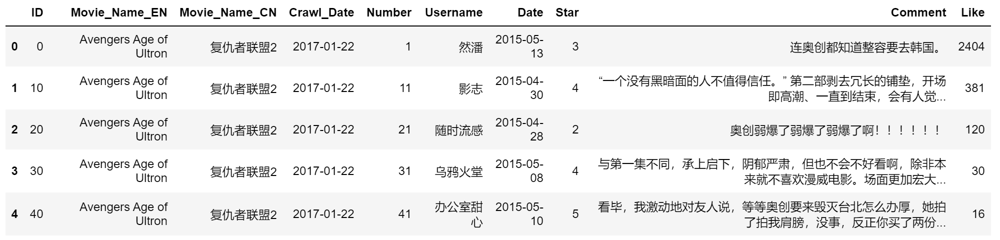
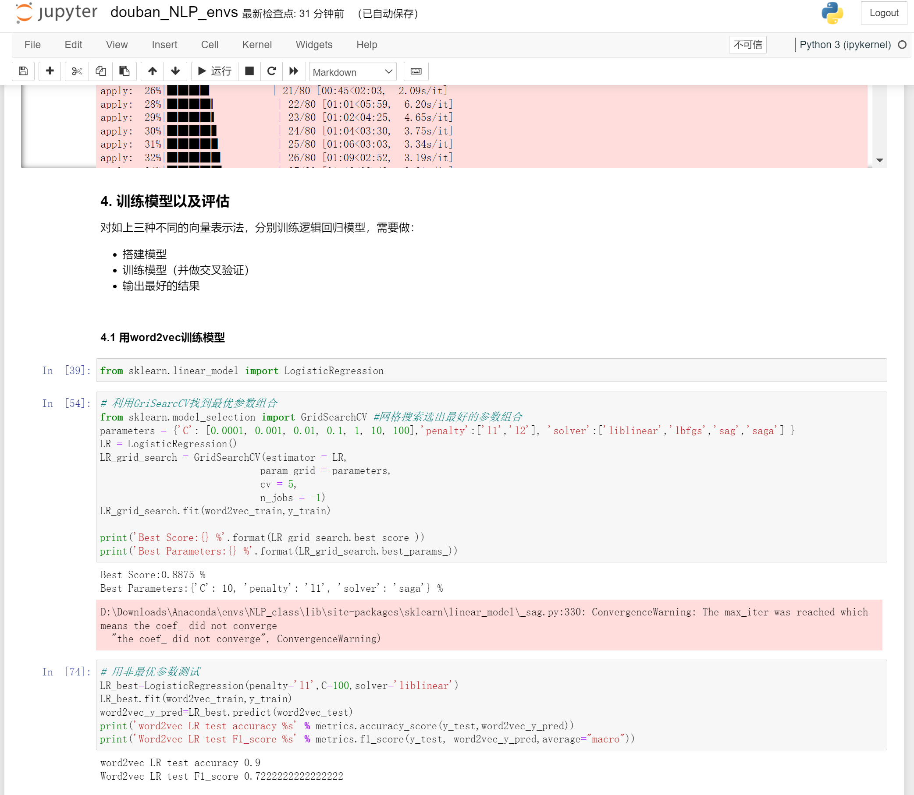

# 豆瓣电影评分预测

本项目基于豆瓣电影平台上用户对电影的评论与打分的数据集，构建一个豆瓣电影评分预测系统。
具体流程如下：

- 中文分词
- 文本预处理（包括去停用词、去低频词等）
- 文本特征提取（使用tf-idf、word2vec、bert embedding三种技术设计文本特征）
- 模型搭建和训练（利用逻辑回归、朴素贝叶斯两个简单的机器学习分类模型搭建算法）

## 1. 准备数据
首先下载[豆瓣电影评分数据集DBMS](https://pan.baidu.com/s/1pIBLEeiv5ychGmj2keNLSQ )，提取码`l9xj`。

另外，实验中还参照了知乎预训练的词向量进行比对，在[此处](https://pan.baidu.com/s/1kaa8EpMrN5r1Gc-ALOVI1w )下载，提取码：`yjic`。

下载后将两个文件放在项目中的data文件夹下。

加载数据后样式如下：

## 2. 逐块运行`douban_NLP_envs.ipynb`文件
示例如下
